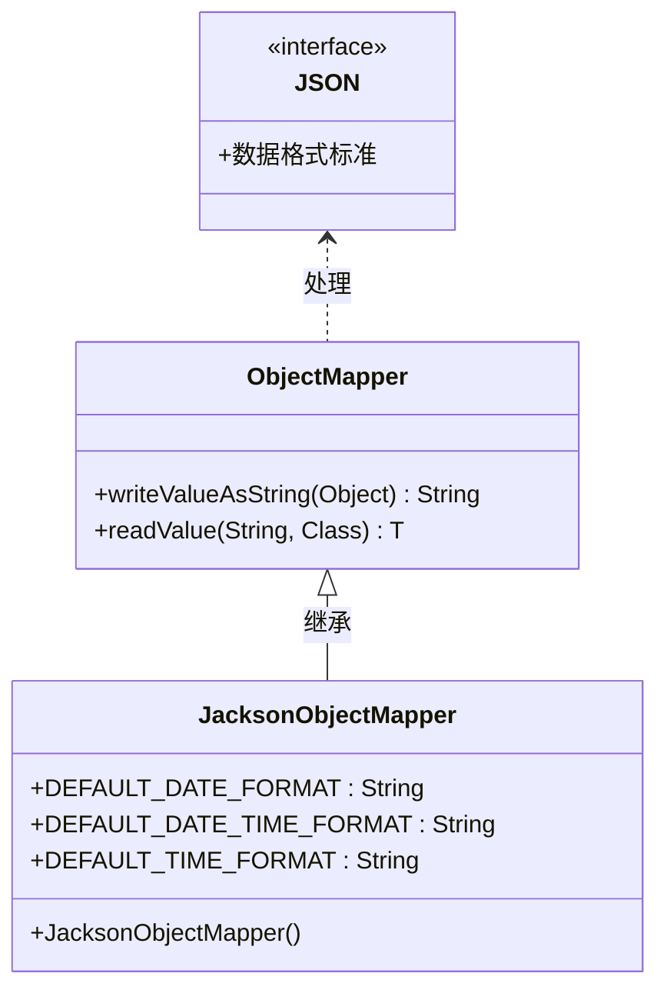

# 瑞吉外卖实现
## 避免前端（JavaScript）处理大数（如 Long、BigInteger）时发生精度丢失问题，所以引入了自定义 Jackson 配置。
先看代码：
```java
 /*
    * 根据id修改员工信息*/
    @PutMapping
    public R<String> update(HttpServletRequest request,@RequestBody Employee employee){
        log.info(employee.toString());

        Long empId = (Long)request.getSession().getAttribute("employee");
        employee.setUpdateTime(LocalDateTime.now());
        employee.setUpdateUser(empId);
        employeeService.updateById(employee);

        return R.success("员工信息修改成功");
    }
```
这里由于要修改的员工信息的id是通过mp雪花算法得到的超长数字，js前端在访问这个数据的时候会出现精度损失，导致后端拿不到这个id，因此无法更新数据
### 1. jackson 是什么？
Jackson 是一个功能强大的 Java 类库，主要用于在 Java 对象 和 JSON 数据之间做转换。
它可以：

把 Java 对象 转成 JSON 字符串（序列化）

把 JSON 字符串 解析成 Java 对象（反序列化）

你可以把 Jackson 理解为 Java 世界里的 "JSON翻译器"。

官网地址：https://github.com/FasterXML/jackson

在 Java 里常用的 JSON 处理库有：

Jackson （最流行）

Gson （Google出的，也挺常见）

Fastjson （阿里出的，国内有些公司用）

其中 Jackson 在 Spring Boot 里默认就是集成的（不用特地引）。
这里我们用json来处理
### 2. jackson 和 json 是什么关系？
JSON（JavaScript Object Notation） 是一种数据交换格式，本身跟 Jackson 没有直接关系。

Jackson 是处理 JSON 的工具，是帮你在 Java 中读写 JSON 的 实现库。

换句话说，JSON 是标准，Jackson 是工具。
就像：“水（JSON）是资源，桶（Jackson）是工具”，你用 Jackson 来搬运、转换 JSON 数据。
### 为什么要特别处理 Long / BigInteger？
这个非常关键！

原因是 JavaScript 的 number 类型（双精度浮点数）在 2^53（大约 16位整数）之后就会失真。
在前端（特别是Vue、React）里，如果后端直接返回数字格式的 Long 或 BigInteger，前端 JSON.parse() 后就精度丢了！

所以你要在后端 把这些大整数转成字符串输出，前端才能安全处理，比如：
```json
{
  "orderId": "9223372036854775807"
}

```
前端拿到字符串后，自己解析或展示，不会丢精度！
因此我们要创建自定义模块来注册，序列化器，反序列化器

### 自定义Jackson ObjectMapper 
```java
SimpleModule simpleModule = new SimpleModule()
```
#### 序列化器
这个是反序列化器(json->java对象):
```java
.addDeserializer(LocalDateTime.class, new LocalDateTimeDeserializer(DateTimeFormatter.ofPattern(DEFAULT_DATE_TIME_FORMAT)))
.addDeserializer(LocalDate.class, new LocalDateDeserializer(DateTimeFormatter.ofPattern(DEFAULT_DATE_FORMAT)))
.addDeserializer(LocalTime.class, new LocalTimeDeserializer(DateTimeFormatter.ofPattern(DEFAULT_TIME_FORMAT)))
```
这里针对 Java 8 时间类型（LocalDateTime、LocalDate、LocalTime）指定了解析格式。

例如，遇到 "2025-04-28 12:00:00" 这样的字符串时，能正确反序列化成 LocalDateTime。

#### 反序列化器
接着这里用反序列化器(java对象->json):
```java
.addSerializer(BigInteger.class, ToStringSerializer.instance)
.addSerializer(Long.class, ToStringSerializer.instance)
.addSerializer(LocalDateTime.class, new LocalDateTimeSerializer(DateTimeFormatter.ofPattern(DEFAULT_DATE_TIME_FORMAT)))
.addSerializer(LocalDate.class, new LocalDateSerializer(DateTimeFormatter.ofPattern(DEFAULT_DATE_FORMAT)))
.addSerializer(LocalTime.class, new LocalTimeSerializer(DateTimeFormatter.ofPattern(DEFAULT_TIME_FORMAT)));

```
将 BigInteger 和 Long 类型序列化为字符串（防止前端 JavaScript 解析大整数丢失精度问题）。

将 LocalDateTime、LocalDate、LocalTime 使用指定格式序列化成字符串。

### jackson整体关系类图

### jacksonObjectMapper结构图 

### 扩展mvc架构的消息转换器
前面知识配置了jackson的信息，但是还没有完成实现，由于后端发给前端的信息的json格式的，而包装发送json数据是mvc设置的，所以我们还需要在mvc配置类中加入扩展mvc架构信息转换器
具体代码如下：
```java
/*
    * 扩展mvc框架的消息转换器
    * */
    @Override
    protected void extendMessageConverters(List<HttpMessageConverter<?>> converters) {
        //创建消息转换器对象
        MappingJackson2HttpMessageConverter messageConverter = new MappingJackson2HttpMessageConverter();
        //设置对象转换器，底层使用jackson将java转成json
        messageConverter.setObjectMapper(new JacksonObjectMapper());
        //将上面的消息转换器对象追加到mvc框架的转换器集合中
        converters.add(0,messageConverter);
    }
```
但是这里由于我们扩展了 SpringMVC 配置，导致 Spring Boot 自动配置失效了。 我们继承了一个 MVC 配置类，打破了默认的静态资源映射规则，在 Spring Boot 中（比如用 spring-boot-starter-web）：
默认情况下，Spring Boot 自动帮你配置好静态资源访问路径，比如：
/static/

/public/

/resources/

/META-INF/resources/
只要把 HTML、CSS、JS 放在 static 里，可以直接通过 URL 访问，无需自己写 addResourceHandlers()。但是！！ 一旦手动继承了 SpringMVC 配置，即使你只是重写 extendMessageConverters()，Spring Boot会认为你要接管整个SpringMVC配置！
于是，Spring Boot默认的静态资源映射失效了。
重写静态资源映射就可以了：
```java
/*
    * 设置静态资源映射*/
    @Override
    protected void addResourceHandlers(ResourceHandlerRegistry registry) {
        log.info("开始进行静态资源映射...");
        registry.addResourceHandler("/backend/**").addResourceLocations("classpath:/static/backend/");
        registry.addResourceHandler("/front/**").addResourceLocations("classpath:/static/front/");
    }
```

## 公共字段自动填充、
前面我们完成后台系统员工管理功能开发，在新增员工时需要设置创建时间、创建人、修改时间、修改人等字段，在编辑员工时需要设置修改时间和修改人等字段，这些属于公共字段
能不能直接对这些公共字段在某一个地方统一处理，来简化开发？
可以用Mybatis Plus提供的公共字段自动填充功能（实际上也可以用Spring自带的AOP功能实现）

### 1、在实体类的属性上加入@TableField注解，指定自动填充的策略
```java
@TableField(fill = FieldFill.INSERT)//插入时填充字段
    private LocalDateTime createTime;

    @TableField(fill = FieldFill.INSERT_UPDATE)
    private LocalDateTime updateTime;

    @TableField(fill = FieldFill.INSERT)
    private Long createUser;

    @TableField(fill = FieldFill.INSERT_UPDATE)//插入和更新时填充字段
    private Long updateUser;
```
### 2、按照框架要求编写元数据对象处理器，在此类中统一为公共字段赋值，此类需要实现MetaObjectHandler接口
```java
/*
 * 自定义原数组对象处理器*/
@Component
@Slf4j
public class MyMetaObjectHandler implements MetaObjectHandler {
    //这里metaObject实际上是元数据
    /*
     * 插入操作，自动填充*/
    @Override
    public void insertFill(MetaObject metaObject) {
        log.info("公共字段自动填充[insert]...");
        log.info(metaObject.toString());
        metaObject.setValue("createTime", LocalDateTime.now());
        metaObject.setValue("updateTime",LocalDateTime.now());
        metaObject.setValue("createUser",new Long(1));//由于我们拿不到request请求中的session，无法获得当前用户的id，这里先用固定属性
        metaObject.setValue("updateUser",new Long(1));
    }

    /*
     * 更新操作，自动填充*/
    @Override
    public void updateFill(MetaObject metaObject) {
        log.info("公共字段自动填充[update]...");
        log.info(metaObject.toString());
        metaObject.setValue("updateTime",LocalDateTime.now());
        metaObject.setValue("updateUser",new Long(1));
    }
}
```
这样就可以不用每次set公共属性，之前更新员工信息和新增员工信息中对应的代码也可以注释掉了

### ThreadLocal
由于我们拿不到request请求中的session，无法获得当前用户的id，所以不够完全，这里需要用ThreadLocal线程技术去实现
客户端每次发送http请求，对应的服务端都会分配一个新的线程来处理，在处理过程中设计下面类中的方法都属于同一个线程：
1、LoginCheckFilter的doFilter方法
2、EmployeeController的update方法
3、MyMetaObjectHandle的updateFill方法
可以在上面的三个方法中分别加入下面代码（获取当前线程id）：
```java
long id = Thread.currentThread().getId();
log.info("线程id：（）",id);
```
运行可以看到是同个线程id


#### 什么是ThreadLocal？
ThreadLocal并不是一个Thread，而是Thread的局部变量。当使用ThreadLocal维护变量时，ThreadLocal为每个使用该变量的线程提供独立的变量副本
所以每一个线程都可以独立地改变自己的副本，而不会影响其他线程对应的副本
ThreadLocal为每一个线程提供单独一份存储空间，具有线程隔离的效果，只有在线程内才能获取对应的值，线程外则不能访问

ThreadLocal常用方法：
public void set(T value) 设置当前线程的线程局部变量的值
public T get() 返回当前线程所对应的线程局部变量的值

那么我们就可以在LoginCheckFilter中的doFilter方法中获取当前登录用户的id，并调用set来设置当前线程局部变量的值（用户id），
然后在MyMetaObjectHandler的updateFill方法中调用get来获取线程对应局部变量值（用户id），也算是曲线救国了hhh

实现步骤：
1、编写BaseContext工具类，基于ThreadLocal封装的工具类
```java
/*
* 基于ThreadLocal封装工具类，用户保存和获取当前登录用户id*/
public class BaseContext {
    private static ThreadLocal<Long> threadLocal = new ThreadLocal<>();

    public static void setCurrentId(Long id){
        threadLocal.set(id);
    }

    public static Long getCurrentId(){
        return threadLocal.get();
    }
}
```
2、在LoginCheckFilter的doFilter方法中调用BaseContext来设置当前登录用户的id
```java
if(request.getSession().getAttribute("employee") != null){
            log.info("用户已登录，用户id为：{}",request.getSession().getAttribute("employee"));
            Long empId = (Long) request.getSession().getAttribute("employee");
            BaseContext.setCurrentId(empId);

            filterChain.doFilter(request,response);
            return;
        }
```
3、在MyMetaObjectHandler的方法中调用BaseContext获取登录用户id
```java
public class MyMetaObjectHandler implements MetaObjectHandler {
    //这里metaObject实际上是元数据
    /*
    * 插入操作，自动填充*/
    @Override
    public void insertFill(MetaObject metaObject) {
        log.info("公共字段自动填充[insert]...");
        log.info(metaObject.toString());
        metaObject.setValue("createTime", LocalDateTime.now());
        metaObject.setValue("updateTime",LocalDateTime.now());
        metaObject.setValue("createUser",BaseContext.getCurrentId());
        metaObject.setValue("updateUser",BaseContext.getCurrentId());
    }

    /*
    * 更新操作，自动填充*/
    @Override
    public void updateFill(MetaObject metaObject) {
        log.info("公共字段自动填充[update]...");
        log.info(metaObject.toString());

        long id = Thread.currentThread().getId();
        log.info("线程id为：{}",id);

        metaObject.setValue("updateTime",LocalDateTime.now());
        metaObject.setValue("updateUser",BaseContext.getCurrentId());
    }
}
```
## 文件上传和下载
文件上传，也称为upload，是指将本地图片，视频，音频等文件上传到服务器上，可以供其他用户浏览或下载的过程

文件上传时对页面的form表单有如下要求：
method="post" 采用post方式提交数据
enctype="multipart/form-data" 采用multipart格式上传文件
type="file" 使用input的file控件上传

服务端要接收客户端页面上传的文件，通常会使用Apache的两个组件：
commons-fileupload
commons-io

Spring框架在spring-web包中对文件上传进行了封装，大大简化了服务端代码，
我们只需要在Controller的方法中声明一个MultipartFile的参数即可接收上传的文件

```java
public class CommonController {

    @Value("${reggie.path}")
    private String basePath;

    /*
    * 文件上传*/
    @PostMapping("/upload")
    public R<String> upload(MultipartFile file) {
        //file是一个临时文件，需要转存到指定位置，否则本次请求完成后临时文件会删除
        log.info(file.toString());

        //原始文件名
        String orginalFilename = file.getOriginalFilename();
        //将原始名的.jpg截取出来
        String suffix = orginalFilename.substring(orginalFilename.lastIndexOf("."));

        //使用UUID重新生成文件名，防止文件名称重复造成文件覆盖
        String fileName = UUID.randomUUID().toString()+suffix;

        //创建一个目录对象
        File dir = new File(basePath);
        //判断当前目录是否存在
        if(!dir.exists()){
            //目录不存在，需要创建
            dir.mkdirs();
        }


        try{
            //将临时文件转存到指定位置
            file.transferTo(new File(basePath+fileName));
        }catch (IOException e){
            e.printStackTrace();
        }
        return R.success(fileName);
    }
}
```


文件下载，也叫download，是指将文件从服务器传输到本地计算机的过程
一种以附件形式下载
另一种直接在浏览器中打开
本质上是服务器将文件以流的形式写回浏览器的过程
```java
 /**
     * 文件下载
     * @param name
     * @param response
     */
    @GetMapping("/download")
    public void download(String name, HttpServletResponse response){

        try{
            //输入流，通过输入流读取文件内容
            FileInputStream fileInputStream = new FileInputStream(new File(basePath+name));

            //输出流，通过输出流将文件写回浏览器，在浏览器展示图片
            ServletOutputStream outputStream = response.getOutputStream();

            response.setContentType("image/jpg");

            int len = 0;
            byte[] bytes = new byte[1024];
            while((len=fileInputStream.read(bytes))!= -1){
                outputStream.write(bytes,0,len);
                outputStream.flush();
            }
            //关闭资源
            outputStream.close();
            fileInputStream.close();

        } catch (Exception e){
            e.printStackTrace();
        }


    }
}
```
这样就可以成功回显图片了

类图：

文件上传：


文件下载：


## 关于短信校验代码中HttpSession
由于涉及到阿里云的短信服务，这里改成直接从服务端查看验证码
代码中有一个关于session的问题：
```java
session.setAttribute("user",user.getId());
```
这一段代码中为什么session.setAttribute("user",user.getId())可以直接保存到前端浏览器的session，不是说session是保存到服务器吗？

### 核心概念澄清
HttpSession 数据确实只存储在服务器端（内存/Redis/数据库等）

浏览器永远不会直接获取或存储 Session 数据，它只保存一个 Session ID（通常通过 Cookie）

代码执行流程详解
session.setAttribute("user", user.getId())

将用户ID 存储在服务器的 Session 对象中（键为 "user"，值为用户ID）

此时没有任何数据发送到浏览器！

Session ID 的传递机制

当第一次调用 request.getSession() 时，服务器会：

创建一个唯一的 JSESSIONID（如 ABC123）

在响应头中通过 Set-Cookie: JSESSIONID=ABC123 告诉浏览器保存此ID
```http
HTTP/1.1 200 OK
Set-Cookie: JSESSIONID=ABC123; Path=/; HttpOnly
```
浏览器后续请求会自动携带此Cookie：
```http
GET /api/userinfo HTTP/1.1
Cookie: JSESSIONID=ABC123
```
服务器如何关联数据

当浏览器携带 JSESSIONID=ABC123 访问时：

服务器通过 ABC123 找到对应的 HttpSession 对象

然后从该对象中读取 getAttribute("user") 获取用户ID

### 为什么看起来像是"保存到前端"？
错觉来源：因为浏览器保存了 JSESSIONID Cookie，使得后续请求能自动关联到服务器的 Session 数据


### 关键结论

session.setAttribute() 只修改服务器端数据

浏览器仅持有 JSESSIONID（无实际用户数据）

如果浏览器禁用Cookie，Session 机制会失效（除非改用URL重写）

