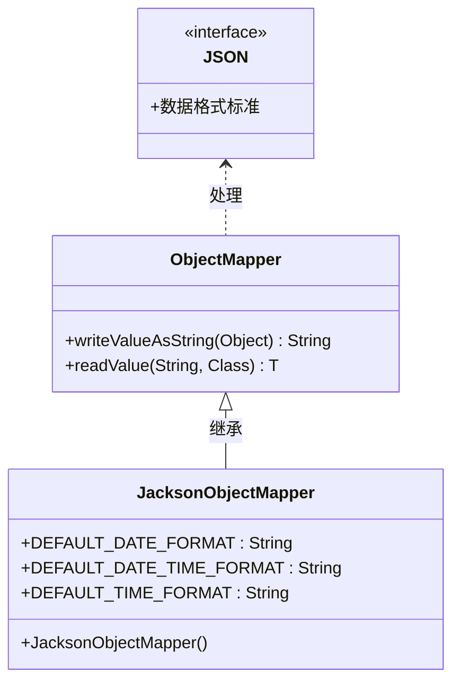
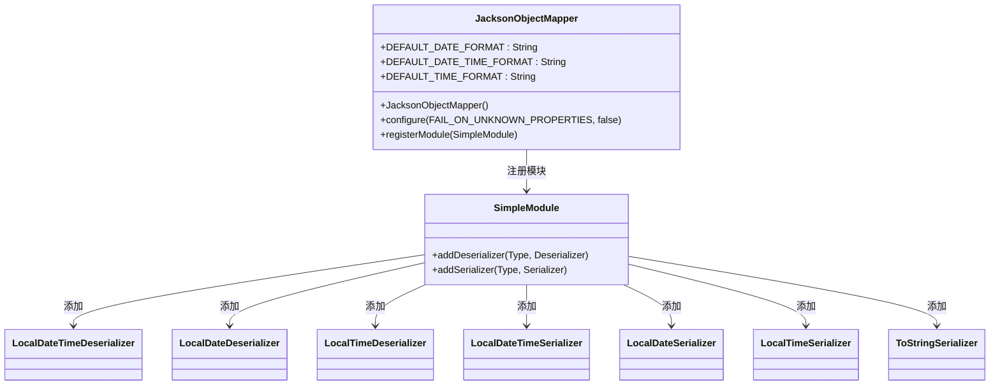

# 瑞吉外卖实现
## 避免前端（JavaScript）处理大数（如 Long、BigInteger）时发生精度丢失问题，所以引入了自定义 Jackson 配置。
先看代码：
```java
 /*
    * 根据id修改员工信息*/
    @PutMapping
    public R<String> update(HttpServletRequest request,@RequestBody Employee employee){
        log.info(employee.toString());

        Long empId = (Long)request.getSession().getAttribute("employee");
        employee.setUpdateTime(LocalDateTime.now());
        employee.setUpdateUser(empId);
        employeeService.updateById(employee);

        return R.success("员工信息修改成功");
    }
```
这里由于要修改的员工信息的id是通过mp雪花算法得到的超长数字，js前端在访问这个数据的时候会出现精度损失，导致后端拿不到这个id，因此无法更新数据
### 1. jackson 是什么？
Jackson 是一个功能强大的 Java 类库，主要用于在 Java 对象 和 JSON 数据之间做转换。
它可以：

把 Java 对象 转成 JSON 字符串（序列化）

把 JSON 字符串 解析成 Java 对象（反序列化）

你可以把 Jackson 理解为 Java 世界里的 "JSON翻译器"。

官网地址：https://github.com/FasterXML/jackson

在 Java 里常用的 JSON 处理库有：

Jackson （最流行）

Gson （Google出的，也挺常见）

Fastjson （阿里出的，国内有些公司用）

其中 Jackson 在 Spring Boot 里默认就是集成的（不用特地引）。
这里我们用json来处理
### 2. jackson 和 json 是什么关系？
JSON（JavaScript Object Notation） 是一种数据交换格式，本身跟 Jackson 没有直接关系。

Jackson 是处理 JSON 的工具，是帮你在 Java 中读写 JSON 的 实现库。

换句话说，JSON 是标准，Jackson 是工具。
就像：“水（JSON）是资源，桶（Jackson）是工具”，你用 Jackson 来搬运、转换 JSON 数据。
### 为什么要特别处理 Long / BigInteger？
这个非常关键！

原因是 JavaScript 的 number 类型（双精度浮点数）在 2^53（大约 16位整数）之后就会失真。
在前端（特别是Vue、React）里，如果后端直接返回数字格式的 Long 或 BigInteger，前端 JSON.parse() 后就精度丢了！

所以你要在后端 把这些大整数转成字符串输出，前端才能安全处理，比如：
```json
{
  "orderId": "9223372036854775807"
}

```
前端拿到字符串后，自己解析或展示，不会丢精度！
因此我们要创建自定义模块来注册，序列化器，反序列化器

### 自定义Jackson ObjectMapper 
```java
SimpleModule simpleModule = new SimpleModule()
```
#### 序列化器
这个是反序列化器(json->java对象):
```java
.addDeserializer(LocalDateTime.class, new LocalDateTimeDeserializer(DateTimeFormatter.ofPattern(DEFAULT_DATE_TIME_FORMAT)))
.addDeserializer(LocalDate.class, new LocalDateDeserializer(DateTimeFormatter.ofPattern(DEFAULT_DATE_FORMAT)))
.addDeserializer(LocalTime.class, new LocalTimeDeserializer(DateTimeFormatter.ofPattern(DEFAULT_TIME_FORMAT)))
```
这里针对 Java 8 时间类型（LocalDateTime、LocalDate、LocalTime）指定了解析格式。

例如，遇到 "2025-04-28 12:00:00" 这样的字符串时，能正确反序列化成 LocalDateTime。

#### 反序列化器
接着这里用反序列化器(java对象->json):
```java
.addSerializer(BigInteger.class, ToStringSerializer.instance)
.addSerializer(Long.class, ToStringSerializer.instance)
.addSerializer(LocalDateTime.class, new LocalDateTimeSerializer(DateTimeFormatter.ofPattern(DEFAULT_DATE_TIME_FORMAT)))
.addSerializer(LocalDate.class, new LocalDateSerializer(DateTimeFormatter.ofPattern(DEFAULT_DATE_FORMAT)))
.addSerializer(LocalTime.class, new LocalTimeSerializer(DateTimeFormatter.ofPattern(DEFAULT_TIME_FORMAT)));

```
将 BigInteger 和 Long 类型序列化为字符串（防止前端 JavaScript 解析大整数丢失精度问题）。

将 LocalDateTime、LocalDate、LocalTime 使用指定格式序列化成字符串。

### jackson整体关系类图

### jacksonObjectMapper结构图 



